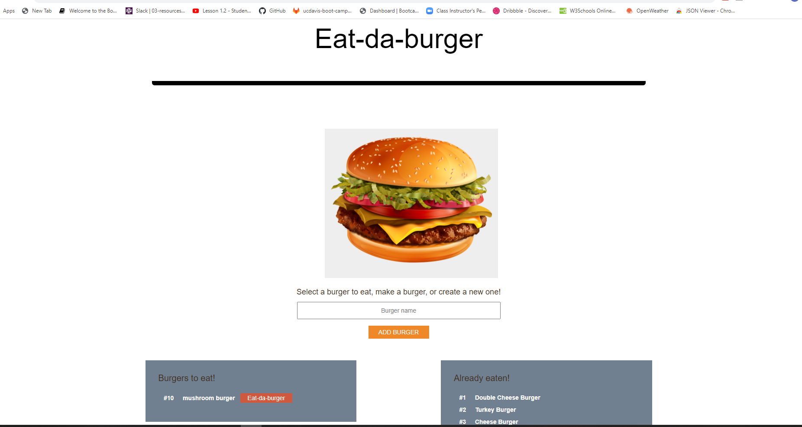

# Node Express Handlebars

A burger logger with MySQL, Node, Express, Handlebars and a homemade ORM.

## Eat da Burger (Screenshot)

### Getting Started

Visit the deployed app at https:// , or run it locally through node by navigating to the directory in your terminal and entering the command "node server.js".

#### Built With

- Node.js
- Express.js
- Handlebars.js
- MySQL
- jQuery
- Javascript
- CSS
- HTML
